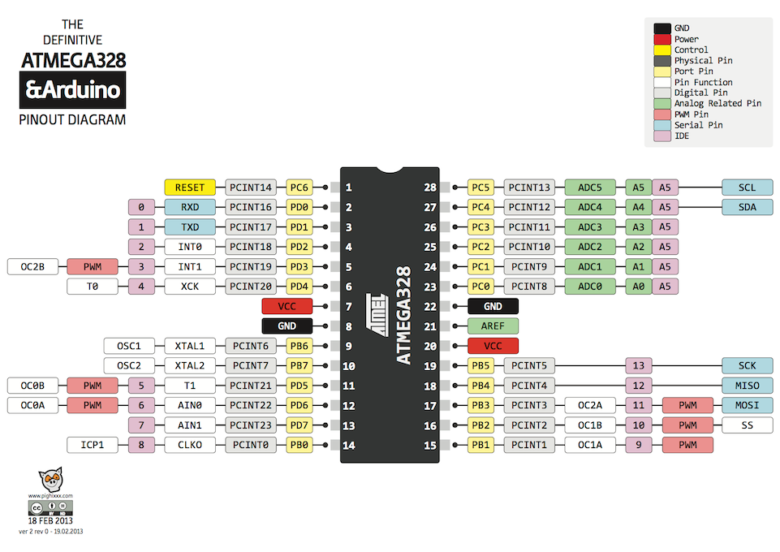

# seminar-arduino

## Распиновка ATMEGA328



Дока на [гугл диске](https://docs.google.com/document/d/1E5u_tU_30d35mxYcNSVe8VHLDNzwZsriz4J4xWrx2XM/edit#heading=h.uh7x8owb0an)
## Лампочка и кнопка чепрез UART 
```c
#define BTN 8
#define LED 13
void setup() {
  pinMode(BTN, INPUT);
  pinMode(LED, OUTPUT);
  
  digitalWrite(LED, LOW);

  Serial.begin(9600);
}

void loop() {
  if(Serial.available()) {
    char data_rcvd = Serial.read();

    if(data_rcvd == '1') digitalWrite(LED, HIGH);
    if(data_rcvd == '0') digitalWrite(LED, LOW);
  }

  if (digitalRead(BTN) == HIGH) Serial.write('1'); 
  else Serial.write('0'); 

}

```

## АЦП
```c
#define adc0Pin A0
int val = 0;

void setup() {
    Serial.begin(9600);
    pinMode(adc0Pin, INPUT);
}

void loop() {
    val = analogRead(adc0Pin);
    Serial.println(val);
    delay(1000);
}
```

## Битовые операции
Примеры ниже в 100 раз быстрее функции digitalWrite из библиотеки ардуино 
```c
void setup() 
{ 
  DDRB |= (1<<5); // аналог pinMode(13, OUTPUT), только быстрый
} 
 
void loop() 
{  
  PORTB |= (1 << 5); // аналог digitalWrite(13, HIGH) 
  delay(1000);
  
  PORTB &= ~(1 << 5); // аналог digitalWrite(13, LOW)
  delay(1000); 
  
  //PORTB ^= (1 << 5); // аналог digitalWrite(13, !digitalRead(13)), только быстрее в 200 раз
}
```

## 7 сегментный индикатор
```c
#define LED_NUMBER_COUNT = 10
int ledNumber[] = { 
    0b00111111,
    0b00000110,
    0b01011011,
    0b01001111,
    0b01100110,
    0b01101101,
    0b01111101,
    0b00000111,
    0b01111111,
    0b01101111
  }; 
 
int i=0; 
 
void setup() 
{ 
   DDRD = 0xFF; // аналог DDRD = 0b11111111, но короче
} 
 
void loop() 
{ 
  int isDotOn = i % 2;
  PORTD = ledNumber[i] | (isDotOn << 7); 
  i = (i+1) % LED_NUMBER_COUNT; 
  delay(1000); 
}
```

## Таймер и АЦП
[Ликбез](https://habr.com/ru/post/453276/) по таймерам 
[Datasheet](https://ww1.microchip.com/downloads/en/DeviceDoc/Atmel-7810-Automotive-Microcontrollers-ATmega328P_Datasheet.pdf)
```c
#define ledPin 7
#define adc0Pin A0
float value = 3035;                   //Preload timer value (3035 for 4 seconds)
void setup()
{
  pinMode(adc0Pin, INPUT);
  pinMode(ledPin, OUTPUT);
  Serial.begin(9600);
  
  noInterrupts();  
  TCCR1A = 0;
  TCCR1B = 0;
  TCCR1B |= (1 << CS10)|(1 << CS12);    // 1024 prescaler 
  TIMSK1 |= (1 << TOIE1);               // enable timer overflow interrupt ISR
  TCNT1 = value;                        // preload timer
  interrupts();                         // enable all interrupts

}

ISR(TIMER1_OVF_vect)
{
  TCNT1 = value;                                   // Preload timer
  digitalWrite(ledPin, !digitalRead(ledPin));      // Turns LED ON and OFF
  //digitalWrite(ledPin, digitalRead(ledPin) ^ 1); // Turns LED ON and OFF
}

void loop()
{ 
  //value = analogRead(adc0Pin);
  //Serial.println(value);
}
```


